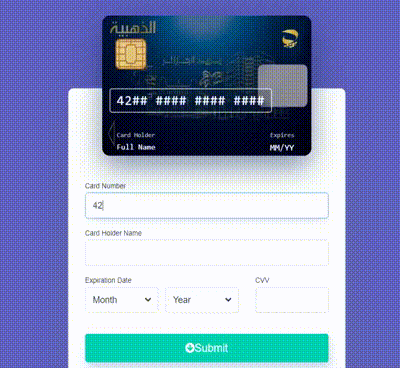

# Edahabia-interactive-paycard-Angular 💳💳

🎉 I developed this library using Angular, for making  customizable animated payment card with payment. submission form .The demo i provided is a redesign of The Algerian payment website checkout of the card EDAHABIA 💳.


<p align="center">
  
  

  
  

  
  
    
  
  
  
  
  
  
  
  
  
  

  
</p>


<p align="center">
  
</p>

## Using the library 📙

 The library is published in Angular package format on in the global registry of `npmjs`. To install the library run in the consumer project following command:


## Install 🚀

To install the dependencies of the workspace run

```bash
npm install
```

To start the library and the demo project in watch mode run

```bash
npm run watch:all
```
The demo of the library will be reachable on `http://localhost:4200`.

## Contributing 🙌
### Step 1
- **give me a star! 🌟**🌟 

### Step 2

- **Option 1**
    - 🍴 Fork this repo!

- **Option 2**
    - 👯 Clone this repo 
### Step 3
- **HACK AWAY!** 🔨🔨🔨


## References 📝
This project is inspired by [vue-interactive-paycard](https://github.com/muhammederdem/vue-interactive-paycard).
The goal of this project is to have an Angular alternative for the original vue based version.

## License 📝

[](http://badges.mit-license.org)
- Copyright 2020 © Raouf Zoghbi.

<h4 align="center">
<a href="http://linkedin.com/in/raoufzoghbi">Connect me in LinkedIn </a> | <a href="https://medium.com/@raaaaouf">See my Medium </a>👀 | <a href=" ">Click here to go to my CV</a>
</h4>
